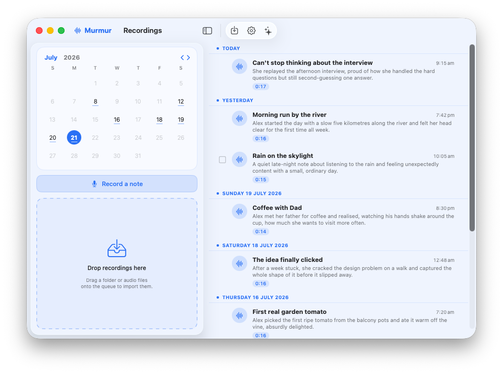
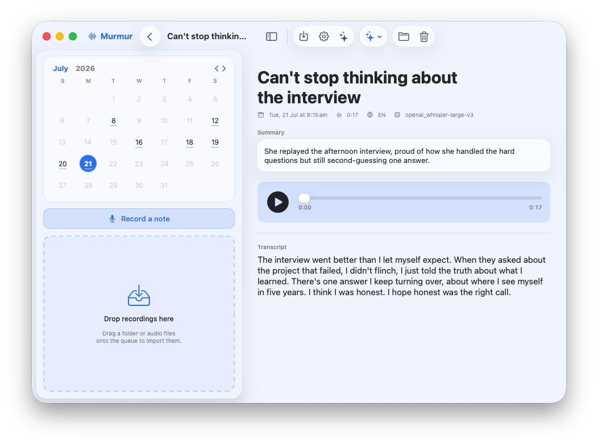
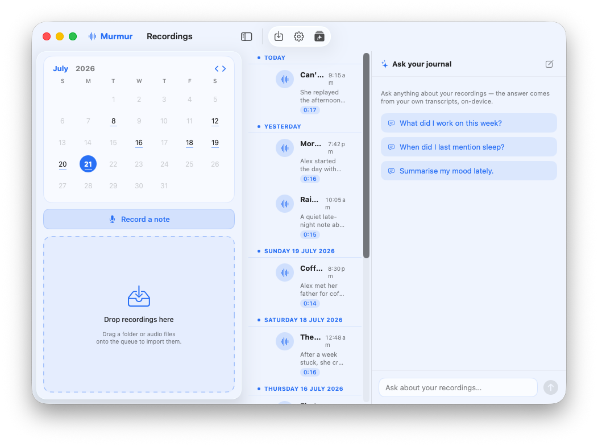

# Murmur

**A spoken journal, transcribed and understood entirely on your Mac.**

Murmur turns voice notes into a diary. Record straight into the app or drop in a
folder of recordings; each one is transcribed locally with Whisper, given an AI
title and summary by a local language model, and laid out as a calendar of days
you can browse, play back, and edit — every word aligned to the audio. You can
also **ask your journal questions in plain language** ("how often did I mention
sleep this month?") and get answers grounded in your own entries. Nothing leaves
your Mac; everything syncs through iCloud Drive.

Free and open source (Apache-2.0). Download the latest build from
[**Releases**](https://github.com/digittl/murmur/releases/latest).



<p align="center">
  
  &nbsp;
  
</p>

## What it does

- **Record a note** with your microphone right inside the app, or **import a
  folder** of recordings (or drag files onto the window). Imports are processed
  oldest-first so the diary fills in chronological order.
- **Local transcription** with [WhisperKit](https://github.com/argmaxinc/WhisperKit)
  (Core ML). Models download once and stay cached.
- **AI title + summary** for every entry via a local model run by a **bundled
  [Ollama](https://github.com/ollama/ollama)** — no key, no network, no separate
  install. Pick a fast model or a richer one; falls back to a heuristic caption
  if no model is ready.
- **Ask your journal**: a chat panel that answers questions about your entries. It
  searches and reads your transcripts with tools, then answers — grounded in what
  you actually recorded, streamed as it thinks. Answers are on-device too.
- **Diary layout**: a month calendar (days with entries are dotted), a
  reverse-chronological feed grouped by day with Today / Yesterday headings, and
  a reading pane per entry. Click a day to filter to it.
- **Playback + timestamps**: play the recording, scrub, and tap any line's
  timestamp to jump there. The current line highlights as it plays.
- **Editable**: fix the title, rewrite the summary (or regenerate it), and
  correct any word inline — edits autosave. Custom caption prompts live in
  Settings.
- **Multi-select**: hover to reveal checkboxes, shift-click to extend a range,
  then bulk-regenerate titles/summaries or delete.
- **Skips duplicates**: dedupe is by audio checksum, so re-importing the same
  folder never doubles anything up. Silent recordings are skipped, not captioned.

## Models

All models run locally. On first launch, onboarding downloads what you pick:

| Role | Purpose | Options |
| --- | --- | --- |
| **Transcription** | Speech → text (WhisperKit) | tiny … large-v3 |
| **Captions** | Entry title + summary | Fast (Llama 3.2 3B) · Best (Qwen2.5 7B) |
| **Ask your journal** | The chat assistant | Standard (Qwen2.5 7B) · Deep (Qwen2.5 14B) |

The assistant defaults to **Deep (14B)** for the most reliable answers; switch any
model any time in Settings ▸ Models.

## Where your files live

Murmur stores everything under your **iCloud Drive** so it syncs across your
Macs automatically — no paid developer profile or entitlement required:

```
~/Library/Mobile Documents/com~apple~CloudDocs/Murmur/
  audio/     copied recordings
  entries/   one JSON per entry (transcript, title, summary, timings)
  chats.json saved "Ask your journal" conversations
```

If iCloud Drive isn't present it falls back to `~/Documents/Murmur/`. One entry
per file means iCloud never has to merge a shared index.

## Requirements

- **macOS 14 (Sonoma)** or later.
- **Apple Silicon** recommended — Whisper runs on the Neural Engine / GPU and the
  language models are far faster there.
- Enough disk for the models you choose (a few GB each). Everything is local; no
  account, key, or network access is needed once models are downloaded.

## Install

Download `Murmur.app.zip` from the
[latest release](https://github.com/digittl/murmur/releases/latest), unzip, and
drag **Murmur** to your Applications folder. First launch walks you through
downloading the models.

Once installed, Murmur keeps itself up to date — it checks for new releases on
launch and offers a one-click **Update now** (Settings ▸ Updates to change this).

### First launch (unsigned app)

Murmur isn't yet notarized by Apple, so Gatekeeper will refuse to open it with a
"can't be opened because it is from an unidentified developer" message. Clear the
quarantine flag once, then open it normally:

```sh
xattr -dr com.apple.quarantine /Applications/Murmur.app
```

(Alternatively: right-click the app ▸ **Open** ▸ **Open** the first time.)

## Build from source

Needs Xcode 16+ (Swift 6):

```sh
zsh build.sh
```

The app is assembled at `dist/Murmur.app` (Ollama is bundled in automatically).
Drag it to `/Applications`.

## Layout

- [`Sources/Murmur/Model/`](Sources/Murmur/Model/) — `Entry`, `Storage` (iCloud
  path resolution), `Library` (load/save/dedupe), `AppSettings`. Platform-agnostic.
- [`Sources/Murmur/Core/`](Sources/Murmur/Core/) — `Transcriber` (WhisperKit),
  `OllamaService` (captions + the chat tool loop), `Importer` (the pipeline),
  `Recorder` (in-app mic capture), `Player`.
- [`Sources/Murmur/App/`](Sources/Murmur/App/) — the SwiftUI app: calendar, diary
  feed, entry detail/editor, onboarding, settings, the import queue, and
  `ChatView`/`ChatStore` (Ask your journal).
- [`assets/mkicon.py`](assets/mkicon.py) — regenerates `AppIcon.icns`.
- [`build.sh`](build.sh) — compiles via SwiftPM, bundles Ollama, and assembles
  `dist/Murmur.app`.

## Verifying

A headless smoke test exercises the whole pipeline (dedupe → transcribe →
summarize → persist) against a throwaway library:

```sh
swift build -c release --product Murmur
"$(swift build -c release --product Murmur --show-bin-path)/Murmur" --selftest /path/to/recordings
```

## License

[Apache-2.0](LICENSE). See [NOTICE](NOTICE) for bundled third-party components.
